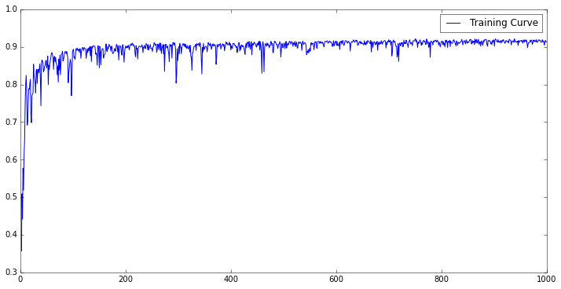
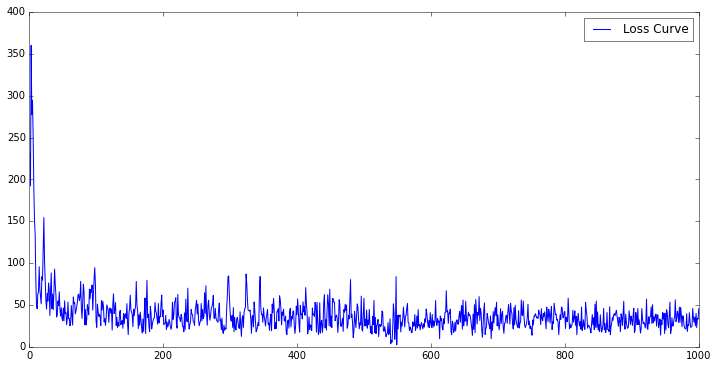

## Linear Regression


Download input_data script from [here](https://tensorflow.googlesource.com/tensorflow/+/master/tensorflow/g3doc/tutorials/mnist/input_data.py).

```python
%matplotlib inline
import input_data
import matplotlib.pyplot as plt
import numpy as np
import tensorflow as tf
```


```python
# Parameters
learning_rate = 0.01
training_epochs = 1000
display_step = 75
batch_size = 100
```


```python
# Data
mnist = input_data.read_data_sets("MNIST_data/", one_hot=True)
```


```python
# Model

# placeholder nodes
x = tf.placeholder(tf.float32, shape=(None, 784), name="x")
y = tf.placeholder(tf.float32, shape=(None, 10), name="y")

# weight and bias nodes
W = tf.Variable(tf.zeros([784, 10]), name="Weight")
b = tf.Variable(tf.zeros([10]), name="Bias")

# prediction/output node
y_pred = tf.nn.softmax(tf.add(tf.matmul(x, W), b))
```


```python
# initialize variables
init = tf.initialize_all_variables()

# define a cost function (cross entropy loss)
cost = - tf.reduce_sum(y * tf.log(y_pred))

# define optimization process
optimizer = tf.train.GradientDescentOptimizer(learning_rate)
train_op = optimizer.minimize(cost)

# log format
log_str = "Epoch: {:03d} cost={:.10f} accuracy={:.10f}"

# list of prediction booleans based on correctness
correct_prediction = tf.equal(tf.argmax(y_pred,1), tf.argmax(y,1))

# cast to floating point numbers and then take the mean
accuracy = tf.reduce_mean(tf.cast(correct_prediction, "float"))
```


```python
accuracy_data = []
loss_data = []

with tf.Session() as sess:
    sess.run(init)    
    
    for epoch in range(training_epochs):
        train_X, train_Y = mnist.train.next_batch(batch_size)
                
        cost_t, W_t, b_t, _ = sess.run([cost, W, b, train_op],
                                       feed_dict = {x: train_X, y: train_Y})
        
        # check accuracy on test data
        accuracy_t = sess.run(accuracy,
                              feed_dict={x: mnist.test.images, y: mnist.test.labels})
        
        # store data
        accuracy_data.append(accuracy_t)
        loss_data.append(cost_t)
        
        if epoch % display_step == 0:
            print log_str.format(epoch+1, cost_t, accuracy_t)
```

    Epoch: 001 cost=230.2582855225 accuracy=0.4074999988
    Epoch: 076 cost=59.6049079895 accuracy=0.8259999752
    Epoch: 151 cost=61.6878547668 accuracy=0.9014999866
    Epoch: 226 cost=30.1221733093 accuracy=0.9024999738
    Epoch: 301 cost=31.9312858582 accuracy=0.9011999965
    Epoch: 376 cost=46.0183944702 accuracy=0.9000999928
    Epoch: 451 cost=36.6950531006 accuracy=0.9039000273
    Epoch: 526 cost=25.8418006897 accuracy=0.8999999762
    Epoch: 601 cost=23.2854671478 accuracy=0.9041000009
    Epoch: 676 cost=19.6863803864 accuracy=0.9121000171
    Epoch: 751 cost=13.8034706116 accuracy=0.9218000174
    Epoch: 826 cost=19.5416717529 accuracy=0.9118999839
    Epoch: 901 cost=25.4934825897 accuracy=0.9021999836
    Epoch: 976 cost=37.0912437439 accuracy=0.9171000123


#### Training Curve




#### Loss Curve

