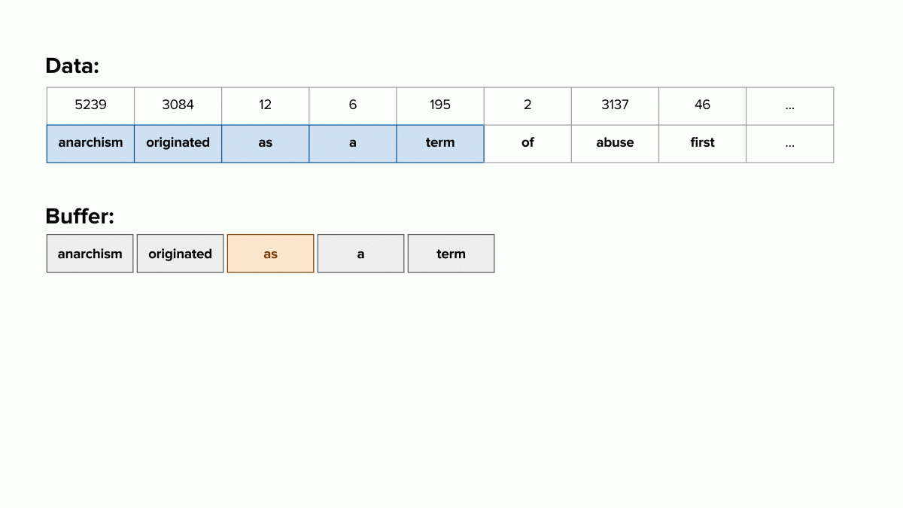
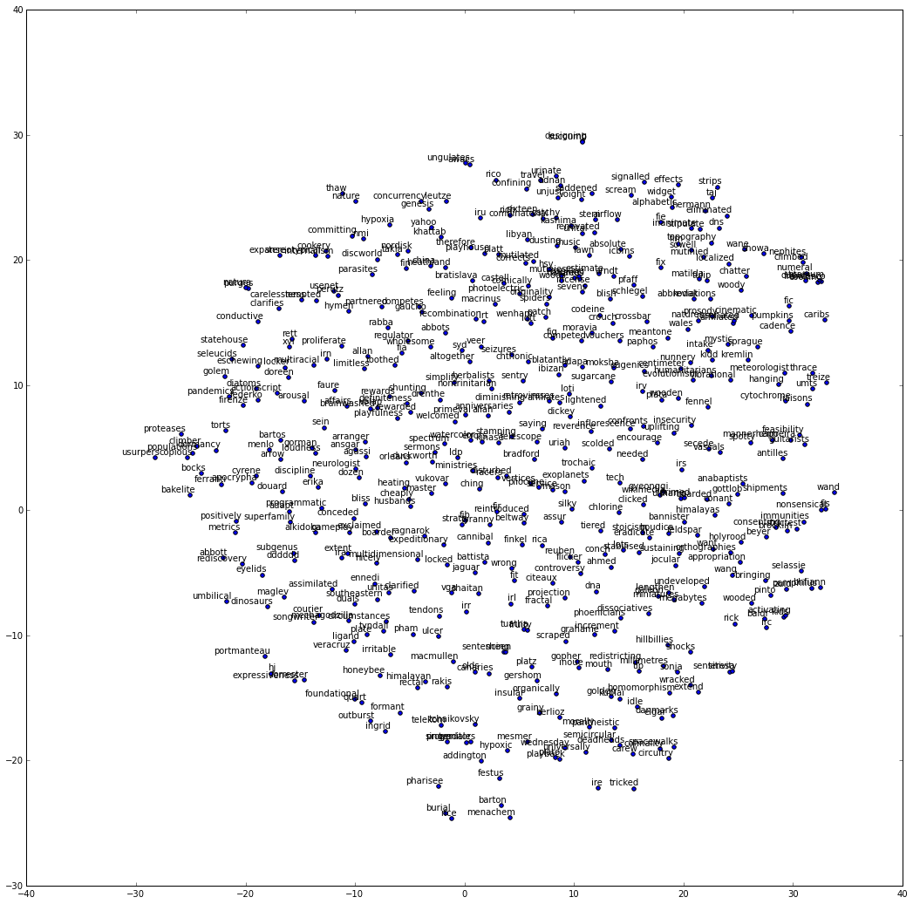

```python
from __future__ import absolute_import
from __future__ import print_function

import collections
import math
import numpy as np
import os
import random

from six.moves import urllib
from six.moves import xrange

import tensorflow as tf
import zipfile

%matplotlib inline
```


```python
# Step 1: Download the data.
url = 'http://mattmahoney.net/dc/'

def maybe_download(filename, expected_bytes):
    """Download a file if not present, and make sure it's the right size."""
    if not os.path.exists(filename):
        filename, _ = urllib.request.urlretrieve(url + filename, filename)
    statinfo = os.stat(filename)
    if statinfo.st_size == expected_bytes:
        print('Found and verified', filename)
    else:
        print(statinfo.st_size)
        raise Exception('Failed to verify ' + filename + '. Can you get to it with a browser?')
    return filename
```


```python
filename = maybe_download('text8.zip', 31344016)
```


```python   
# Read the data into a string.
def read_data(filename):
    f = zipfile.ZipFile(filename)
    for name in f.namelist():
        return f.read(name).split()
    f.close()
```


```python
words = read_data(filename)
print('Data size', len(words))
```


```python
# Step 2: Build the dictionary and replace rare words with UNK token.
vocabulary_size = 50000


def build_dataset(words):
    count = [['UNK', -1]]
    count.extend(collections.Counter(words).most_common(vocabulary_size - 1))
    dictionary = dict()
    for word, _ in count:
        dictionary[word] = len(dictionary)
    data = list()
    unk_count = 0
    for word in words:
        if word in dictionary:
            index = dictionary[word]
        else:
            index = 0  # dictionary['UNK']
            unk_count = unk_count + 1
        data.append(index)
    count[0][1] = unk_count
    reverse_dictionary = dict(zip(dictionary.values(), dictionary.keys()))
    return data, count, dictionary, reverse_dictionary
```


```python
data, count, dictionary, reverse_dictionary = build_dataset(words)
```


```python
# To reduce memory.
del words
```





```python
data_index = 0

# Step 4: Function to generate a training batch for the skip-gram model.
def generate_batch(batch_size, num_skips, skip_window):
    global data_index
    assert batch_size % num_skips == 0
    assert num_skips <= 2 * skip_window
    batch = np.ndarray(shape=(batch_size), dtype=np.int32)
    labels = np.ndarray(shape=(batch_size, 1), dtype=np.int32)
    span = 2 * skip_window + 1 # [ skip_window target skip_window ]
    buffer = collections.deque(maxlen=span)
    # select the next span # of tokens into buffer
    for _ in range(span):
        buffer.append(data[data_index])
        data_index = (data_index + 1) % len(data)
    for i in range(batch_size // num_skips):
        # target label at the center of the buffer
        target = skip_window
        targets_to_avoid = [ skip_window ]
        for j in range(num_skips):
            # select words other than center word and the
            # previously selected target words as the next target
            while target in targets_to_avoid:
                target = random.randint(0, span - 1)
            targets_to_avoid.append(target)
            # store the selected word in batch and label
            batch[i * num_skips + j] = buffer[skip_window]
            labels[i * num_skips + j, 0] = buffer[target]
        buffer.append(data[data_index])
        data_index = (data_index + 1) % len(data)
    return batch, labels
```


```python
batch, labels = generate_batch(batch_size=8, num_skips=2, skip_window=2)
for i in range(8):
    print(reverse_dictionary[batch[i]], '->', reverse_dictionary[labels[i, 0]])
```

    as -> anarchism
    as -> originated
    a -> term
    a -> as
    term -> of
    term -> as
    of -> a
    of -> term


```python
# Step 5: Build and train a skip-gram model.

batch_size = 128
embedding_size = 128  # Dimension of the embedding vector.
skip_window = 1       # How many words to consider left and right.
num_skips = 2         # How many times to reuse an input to generate a label.

learning_rate = 1.0

# We pick a random validation set to sample nearest neighbors. Here we limit the
# validation samples to the words that have a low numeric ID, which by
# construction are also the most frequent.
valid_size = 16     # Random set of words to evaluate similarity on.
valid_window = 100  # Only pick dev samples in the head of the distribution.
valid_examples = np.array(random.sample(np.arange(valid_window), valid_size))
num_sampled = 64    # Number of negative examples to sample.
```


```python
graph = tf.Graph()

with graph.as_default():
    # Input data.
    train_inputs = tf.placeholder(tf.int32, shape=[batch_size])
    train_labels = tf.placeholder(tf.int32, shape=[batch_size, 1])
    valid_dataset = tf.constant(valid_examples, dtype=tf.int32)
    
    # Construct the variables
    embeddings = tf.Variable(tf.random_uniform([vocabulary_size, embedding_size], -1.0, 1.0))
    nce_weights = tf.Variable(tf.truncated_normal([vocabulary_size, embedding_size],
                                                  stddev=1.0 / math.sqrt(embedding_size)))
    nce_biases = tf.Variable(tf.zeros([vocabulary_size]))
    
    # Look up embeddings for inputs
    embed = tf.nn.embedding_lookup(embeddings, train_inputs)
    
    # Compute the average NCE loss for the batch
    # tf.nce_loss automatically draws a new sample of the negative labels each
    # time we evaluate the loss
    loss = tf.reduce_mean(tf.nn.nce_loss(nce_weights, nce_biases, embed, train_labels,
                                         num_sampled, vocabulary_size))
    
    # Define optimization process
    optimizer = tf.train.GradientDescentOptimizer(learning_rate).minimize(loss)
    
    # Compute the cosine similarity between the minibatch examples and all embeddings
    norm = tf.sqrt(tf.reduce_sum(tf.square(embeddings), 1, keep_dims=True))
    normalized_embeddings = embeddings / norm
    valid_embeddings = tf.nn.embedding_lookup(normalized_embeddings, valid_dataset)
    similarity = tf.matmul(valid_embeddings, normalized_embeddings, transpose_b=True)
```


```python
# Step 6: Begin training
num_steps = 100001

with tf.Session(graph=graph) as session:
    # Initialize all variables
    tf.initialize_all_variables().run()
    print("Initialized")
    
    average_loss = 0
    for step in xrange(num_steps):
        batch_inputs, batch_labels = generate_batch(batch_size, num_skips, skip_window)
        feed_dict = {train_inputs: batch_inputs, train_labels: batch_labels}
        
        # We perform one update step
        _, loss_val = session.run([optimizer, loss], feed_dict=feed_dict)
        average_loss += loss_val
        
        if step % 500 == 0:
            if step > 0:
                average_loss = average_loss / 200
            # The average loss is the estimate of the loss of the last 200 batches
            print("Average loss at step ", step, ": ", average_loss)
            average_loss = 0
        
        if step % 100000 == 0:
            sim = similarity.eval()
            for i in xrange(valid_size):
                valid_word = reverse_dictionary[valid_examples[i]]
                top_k = 8 # number of nearest neighbors
                nearest = (-sim[i, :]).argsort()[1:top_k+1]
                log_str = "Nearest to %s:" % valid_word
                for k in xrange(top_k):
                    close_word = reverse_dictionary[nearest[k]]
                    log_str = "%s %s," % (log_str, close_word)
                    print(log_str)
    final_embeddings = normalized_embeddings.eval()
```

    Initialized
    Average loss at step  0 :  285.583251953
    Average loss at step  500 :  428.758338852
    Average loss at step  1000 :  283.268320103
    Average loss at step  1500 :  228.5215839
    Average loss at step  2000 :  191.774891796
    Average loss at step  2500 :  159.93582942
    Average loss at step  3000 :  137.294955945
    Average loss at step  3500 :  122.099582517
    Average loss at step  4000 :  109.497456622
    Average loss at step  4500 :  94.7525076699
    Average loss at step  5000 :  85.764752872
    Average loss at step  5500 :  82.8519791341
    Average loss at step  6000 :  72.5306529307
    Average loss at step  6500 :  66.4839231205
    Average loss at step  7000 :  58.6965783656
    Average loss at step  7500 :  57.3238526964
    Average loss at step  8000 :  53.8681944823
    Average loss at step  8500 :  50.3917059064
    Average loss at step  9000 :  45.8304099679
    Average loss at step  9500 :  42.2709227848
    Average loss at step  10000 :  40.6389767814
    Average loss at step  10500 :  39.2648523617
    Average loss at step  11000 :  35.7882754636
    Average loss at step  11500 :  33.6145285809
    Average loss at step  12000 :  33.64484828
    Average loss at step  12500 :  32.4789957047
    Average loss at step  13000 :  30.1183987951
    Average loss at step  13500 :  27.7321311617
    Average loss at step  14000 :  26.1245662856
    Average loss at step  14500 :  26.7725435209
    Average loss at step  15000 :  26.5112179446
    Average loss at step  15500 :  23.2872394097
    Average loss at step  16000 :  21.6197949755
    Average loss at step  16500 :  23.0829404032
    Average loss at step  17000 :  20.7143212819
    Average loss at step  17500 :  21.3856839287
    Average loss at step  18000 :  21.2244082403
    Average loss at step  18500 :  21.337829206
    Average loss at step  19000 :  20.0292027724
    Average loss at step  19500 :  17.4134456444
    Average loss at step  20000 :  18.7967812955
    Average loss at step  20500 :  18.3855812407
    Average loss at step  21000 :  17.9511473012
    Average loss at step  21500 :  18.4953167593
    Average loss at step  22000 :  18.4718083382
    Average loss at step  22500 :  17.1282980657
    Average loss at step  23000 :  17.0122556317
    Average loss at step  23500 :  18.4362551475
    Average loss at step  24000 :  16.6301411474
    Average loss at step  24500 :  16.9286582315
    Average loss at step  25000 :  16.9970615661
    Average loss at step  25500 :  15.8421858442
    Average loss at step  26000 :  16.9286820924
    Average loss at step  26500 :  16.3536562216
    Average loss at step  27000 :  15.4627274549
    Average loss at step  27500 :  14.3847725403
    Average loss at step  28000 :  15.2624092543
    Average loss at step  28500 :  15.0963325548
    Average loss at step  29000 :  15.6294636548
    Average loss at step  29500 :  15.5163732088
    Average loss at step  30000 :  14.7787593472
    Average loss at step  30500 :  14.8361494696
    Average loss at step  31000 :  14.983463093
    Average loss at step  31500 :  14.1883582139
    Average loss at step  32000 :  14.3293981457
    Average loss at step  32500 :  14.4335199881
    Average loss at step  33000 :  14.9879098594
    Average loss at step  33500 :  14.8994878864
    Average loss at step  34000 :  14.4523075366
    Average loss at step  34500 :  14.3939812064
    Average loss at step  35000 :  14.7784492302
    Average loss at step  35500 :  14.3203339183
    Average loss at step  36000 :  13.6004003906
    Average loss at step  36500 :  12.6381916261
    Average loss at step  37000 :  12.2979668069
    Average loss at step  37500 :  13.2805212772
    Average loss at step  38000 :  14.298464421
    Average loss at step  38500 :  13.9376432061
    Average loss at step  39000 :  14.1442569709
    Average loss at step  39500 :  13.0937076032
    Average loss at step  40000 :  13.5151023793
    Average loss at step  40500 :  14.0385811627
    Average loss at step  41000 :  12.6092536831
    Average loss at step  41500 :  13.1765063
    Average loss at step  42000 :  13.2828702247
    Average loss at step  42500 :  13.3391801667
    Average loss at step  43000 :  13.2090999937
    Average loss at step  43500 :  13.6539728808
    Average loss at step  44000 :  12.5872904706
    Average loss at step  44500 :  13.1992081082
    Average loss at step  45000 :  13.2394317806
    Average loss at step  45500 :  13.222135855
    Average loss at step  46000 :  13.0041740799
    Average loss at step  46500 :  12.3268404186
    Average loss at step  47000 :  12.5424030697
    Average loss at step  47500 :  12.8821307981
    Average loss at step  48000 :  12.3342716706
    Average loss at step  48500 :  12.9293071723
    Average loss at step  49000 :  13.2408719718
    Average loss at step  49500 :  12.1670482969
    Average loss at step  50000 :  13.1836041093
    Average loss at step  50500 :  12.9370579255
    Average loss at step  51000 :  13.008661691
    Average loss at step  51500 :  12.9582463086
    Average loss at step  52000 :  12.7628378975
    Average loss at step  52500 :  12.6300778234
    Average loss at step  53000 :  12.8043556201
    Average loss at step  53500 :  12.7926494753
    Average loss at step  54000 :  12.9343176126
    Average loss at step  54500 :  12.4706836593
    Average loss at step  55000 :  12.6651290405
    Average loss at step  55500 :  12.8902397406
    Average loss at step  56000 :  12.5971626747
    Average loss at step  56500 :  12.6512838888
    Average loss at step  57000 :  12.4033388627
    Average loss at step  57500 :  12.4728984356
    Average loss at step  58000 :  13.411584183
    Average loss at step  58500 :  12.2028065753
    Average loss at step  59000 :  12.5682340217
    Average loss at step  59500 :  12.36705796
    Average loss at step  60000 :  12.1985774714
    Average loss at step  60500 :  12.0766746044
    Average loss at step  61000 :  12.0801552618
    Average loss at step  61500 :  11.6875700998
    Average loss at step  62000 :  11.9614995182
    Average loss at step  62500 :  11.4538309085
    Average loss at step  63000 :  11.427246995
    Average loss at step  63500 :  12.1513895249
    Average loss at step  64000 :  12.7512371075
    Average loss at step  64500 :  12.7832179618
    Average loss at step  65000 :  12.339951514
    Average loss at step  65500 :  12.3916590953
    Average loss at step  66000 :  12.18512097
    Average loss at step  66500 :  12.4431125903
    Average loss at step  67000 :  12.1487273097
    Average loss at step  67500 :  12.2577354801
    Average loss at step  68000 :  12.3262829232
    Average loss at step  68500 :  11.6315139997
    Average loss at step  69000 :  11.8223885787
    Average loss at step  69500 :  12.2540096068
    Average loss at step  70000 :  12.1410235322
    Average loss at step  70500 :  12.1830497301
    Average loss at step  71000 :  11.9949790478
    Average loss at step  71500 :  11.840396111
    Average loss at step  72000 :  11.9094760001
    Average loss at step  72500 :  11.7182872546
    Average loss at step  73000 :  12.1384088063
    Average loss at step  73500 :  12.1398713255
    Average loss at step  74000 :  11.6773229924
    Average loss at step  74500 :  12.3629447961
    Average loss at step  75000 :  12.3623214006
    Average loss at step  75500 :  12.0845909619
    Average loss at step  76000 :  12.0589234161
    Average loss at step  76500 :  11.8906397843
    Average loss at step  77000 :  12.2771432257
    Average loss at step  77500 :  11.8026244438
    Average loss at step  78000 :  12.0020536828
    Average loss at step  78500 :  12.094637816
    Average loss at step  79000 :  11.9904724288
    Average loss at step  79500 :  11.9067619681
    Average loss at step  80000 :  12.1600504673
    Average loss at step  80500 :  12.0567365992
    Average loss at step  81000 :  12.1415372026
    Average loss at step  81500 :  11.8822563231
    Average loss at step  82000 :  12.0345231128
    Average loss at step  82500 :  11.8050160968
    Average loss at step  83000 :  12.1037986708
    Average loss at step  83500 :  12.0881346369
    Average loss at step  84000 :  11.9000874531
    Average loss at step  84500 :  11.8427214575
    Average loss at step  85000 :  12.2515019834
    Average loss at step  85500 :  11.6420107484
    Average loss at step  86000 :  11.9932248688
    Average loss at step  86500 :  11.7174583495
    Average loss at step  87000 :  11.7310380566
    Average loss at step  87500 :  11.6917120349
    Average loss at step  88000 :  11.7310745871
    Average loss at step  88500 :  12.1381411338
    Average loss at step  89000 :  11.8161187863
    Average loss at step  89500 :  11.6871560001
    Average loss at step  90000 :  11.8840669751
    Average loss at step  90500 :  11.7652159476
    Average loss at step  91000 :  11.7843055928
    Average loss at step  91500 :  11.9388490224
    Average loss at step  92000 :  11.6432175279
    Average loss at step  92500 :  11.6123287165
    Average loss at step  93000 :  11.3228435832
    Average loss at step  93500 :  11.6605179489
    Average loss at step  94000 :  11.625553267
    Average loss at step  94500 :  12.0289799809
    Average loss at step  95000 :  11.6391025269
    Average loss at step  95500 :  11.9993456697
    Average loss at step  96000 :  11.6659633923
    Average loss at step  96500 :  11.6820748973
    Average loss at step  97000 :  11.508941803
    Average loss at step  97500 :  11.3571379793
    Average loss at step  98000 :  11.7795493817
    Average loss at step  98500 :  11.8510401964
    Average loss at step  99000 :  11.5766951537
    Average loss at step  99500 :  11.6889933419
    Average loss at step  100000 :  11.68572312


```python
# Step 7: Visualize the embeddings.
def plot_with_labels(low_dim_embs, labels):
    assert low_dim_embs.shape[0] >= len(labels), "More labels than embeddings"
    plt.figure(figsize=(18, 18))
    for i, label in enumerate(labels):
        x, y = low_dim_embs[i, :]
        plt.scatter(x, y)
        plt.annotate(label, 
                    xy=(x, y),
                    xytext=(5, 2),
                    textcoords='offset points',
                    ha='right',
                    va='bottom')
```


```python
try:
    from sklearn.manifold import TSNE
    import matplotlib.pyplot as plt
    tsne = TSNE(perplexity=30, n_components=2, init='pca', n_iter=5000)
    plot_only = 500
    low_dim_embs = tsne.fit_transform(final_embeddings[:plot_only,:])
    labels = list(dictionary.keys())[:plot_only]
    plot_with_labels(low_dim_embs, labels)
except ImportError:
    print("Please install sklearn and matplotlib to visualize embeddings.")
```



